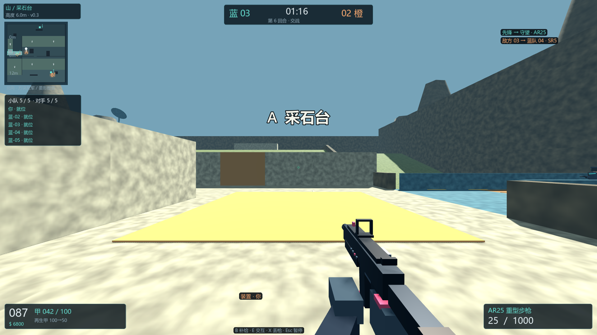
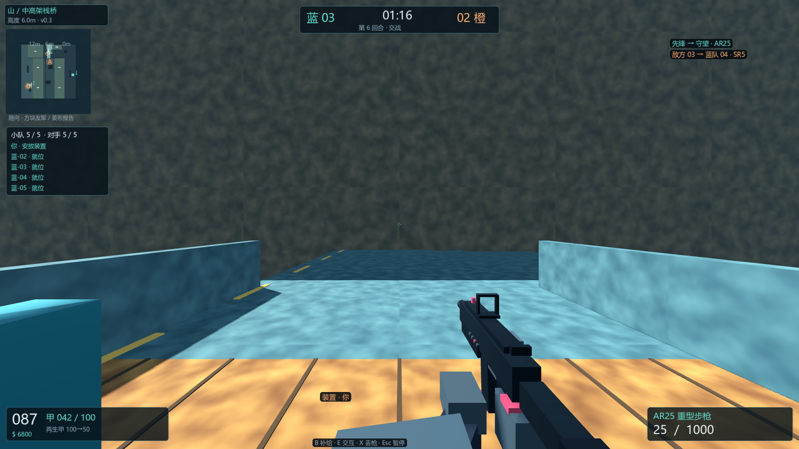
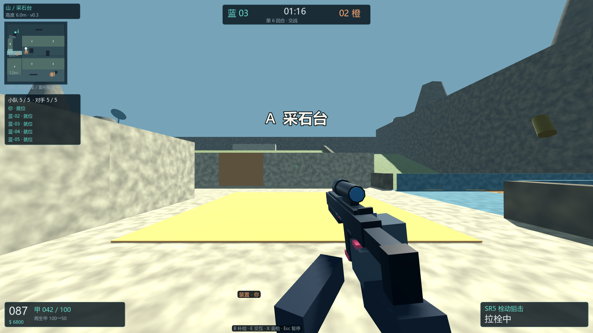

# 孤锋演训（Solo Breach）v0.3

一款可离线运行的 Windows 64 位战术射击游戏。v0.3 带来更大的山地战场、5v5 Bot、10 种枪械、三类护甲、真实地面拾枪，以及进一步完善的 HUD、动作和音频。

## 官方下载

**推荐：[下载 Windows 64 位便携 ZIP](https://github.com/1948666760dty-sys/solo-breach/releases/latest/download/SoloBreach-v0.3-Windows-x64.zip)**

备用：[下载独立 EXE](https://github.com/1948666760dty-sys/solo-breach/releases/latest/download/SoloBreach-v0.3-Windows-x64.exe) · [查看最新版本及完整校验值](https://github.com/1948666760dty-sys/solo-breach/releases/latest)

- 系统：Windows 64 位
- 运行方式：本地离线运行
- 无需安装 Godot，无需注册或登录账号

## 游戏画面







## v0.3 主要内容

- **山地地图：** 约为原港区三倍的可玩面积，包含西峡谷、盘山路、采石平台、观测站、高架桥及桥下隧道，并有 0—12 米高差、可互动滑门和可破坏木板。
- **5v5 Bot：** 双方可分别设置保守、均衡或激进风格；Bot 会处理声音线索、队友报告、压制、友军挡线、最后观察点搜索和装置任务。
- **10 种枪械：** 新增 B30 三连发步枪与 L75 轻机枪；战术换弹、空仓换弹、SG8 逐发装填和 SR5 拉栓均有独立阶段。
- **护甲与拾枪：** 轻甲、重甲、再生甲，以及保留弹匣、备弹、涂装和必要上膛状态的真实地面枪械交换。
- **HUD 与瞄准：** 紧凑青绿十字准星、三档 ADS 曲线、HUD 缩放、配色、小地图大小／透明度／朝向、队友轮廓和设置搜索。
- **动作与音频：** 第一／第三人称动作、命中和材质反馈、枪械／脚步／环境／UI 独立音量、空间远近枪声与室内混响。

## 默认操作

| 按键 | 功能 |
| --- | --- |
| WASD／鼠标 | 移动／转向 |
| 鼠标左键／右键 | 开火／瞄准；持刀时轻刀／重刀 |
| R | 换弹 |
| B | 补给 |
| E | 装置、门或地面枪械交互 |
| X | 丢下当前枪械 |
| G | 丢下携带的装置 |
| Esc | 暂停、规则页或设置 |

## 解压与启动

1. 下载 `SoloBreach-v0.3-Windows-x64.zip`。
2. 将 ZIP 完整解压到普通文件夹。
3. 运行其中的 `SoloBreach-v0.3.exe`。

也可以直接下载并运行独立 EXE。便携 ZIP 是面向普通玩家的推荐版本，因为它同时包含说明、验收索引和第三方许可。

## SHA256 校验

Release 同时提供 `SHA256SUMS.txt`。在 PowerShell 中可运行：

```powershell
Get-FileHash .\SoloBreach-v0.3-Windows-x64.zip -Algorithm SHA256
```

结果应为：

```text
256C697B3E6C7B66850F7A9754CEC46F42E9371141D50E0DFC9D5DB16938763F
```

独立 EXE 的 SHA256 为：

```text
8474382F12DF954B9BF0449590227CBA123C60D2F4FE99B4F868C68A344D310C
```

## 验证范围与边界

最终 EXE 已完成并通过：CPU 9 阶段共 **206 项**、原生交互 **75 项**、旧交互兼容 **8 项**、原生 UI **71 张矩阵＋11 张局部画面**、实际音频 **31 项**，以及退出后的即时／2 分钟／10 分钟文件完整性复查。

自然山地 10 Bot 5v5 场景完成 3 回合、763 发射击，三回合均因防守方全灭结束，因此该自然场景中未观察到安放。另一个两人受控场景中，Bot 走近目标后按真实计时完成了 **3 秒安放**与 **7 秒拆除**。两类结果分别记录，受控结果不代表自然 5v5 已观察到安放。

## Windows 安全提示

当前 EXE **没有数字签名**，Windows 可能显示“未知发布者”或 Microsoft Defender SmartScreen 提示。请只从本仓库的 Release 下载，并在运行前核对 SHA256。

## 权利与源码说明

本仓库仅用于成品发布。**游戏源码未公开，项目内容保留全部权利；未授予修改或再分发权。** Godot 与第三方组件继续按各自许可使用，完整文本见 [THIRD_PARTY_NOTICES.txt](THIRD_PARTY_NOTICES.txt)。

GitHub 在每个 Release 中自动显示的 **“Source code (zip)”** 与 **“Source code (tar.gz)”** 只包含本下载页的 README、三张截图和第三方许可声明，**不是游戏源码，也不能直接运行**。


## 其他项目

AI 助手 Skill 已移至独立的 [Agent Skills 分类仓库](https://github.com/1948666760dty-sys/agent-skills)，包括复杂酒馆、不着急和减脂教练。本仓库继续用于孤锋演训游戏发布。
